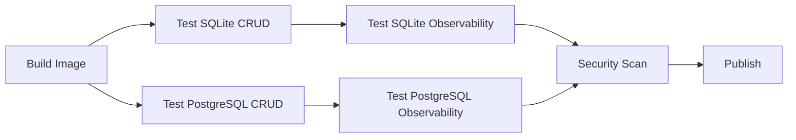

# 可观测性 E2E 测试实现总结

## ✅ 已完成的工作

### 1. 测试文件创建
- **`observability_test.go`** - 完整的可观测性测试套件
  - 13 个测试用例覆盖所有关键指标
  - 使用 Ginkgo BDD 风格编写
  - 支持 SQLite 和 PostgreSQL 两种后端

### 2. 测试覆盖范围

#### Prometheus 指标测试 ✅
- [x] 指标端点可用性 (`/metrics` 返回 200)
- [x] HTTP 请求指标
  - `apify_http_requests_total`
  - `apify_http_request_duration_seconds`
  - `apify_active_connections`
- [x] 系统指标
  - `apify_worker_threads`
- [x] 数据库指标
  - `apify_db_queries_total`
  - `apify_db_query_duration_seconds`
- [x] 指标标签验证
  - `method`, `path`, `status`
  - `operation`, `table`
- [x] 直方图桶验证
- [x] 性能测试（高负载场景）

#### 健康检查测试 ✅
- [x] `/healthz` 端点返回正确状态
- [x] 健康检查被记录在指标中

### 3. CI/CD 集成 ✅
- **GitHub Actions 工作流更新**
  - SQLite 测试增加可观测性测试步骤
  - PostgreSQL 测试增加可观测性测试步骤
  - 正确配置 `METRICS_PORT` 环境变量

### 4. 工具和脚本 ✅
- **Makefile** 更新
  - `make test-observability` - 运行可观测性测试
  - `make test-crud` - 运行 CRUD 测试
  - `make test-all` - 运行所有测试
  
- **`test-observability.sh`** - 便捷测试脚本
  - 自动检查服务状态
  - 提供详细的故障排除提示
  - 支持环境变量配置

### 5. 文档 ✅
- **`OBSERVABILITY_TESTS.md`** - 详细的测试文档
  - 测试场景说明
  - 快速开始指南
  - 故障排除指南
  - 扩展指南
  
- **`README.md`** 更新
  - 添加可观测性测试说明
  - 更新 Makefile 目标列表
  - 新增环境变量说明

## 📊 测试统计

| 测试类别 | 测试数量 | 状态 |
|---------|---------|------|
| 指标端点 | 6 | ✅ |
| 健康检查 | 2 | ✅ |
| 性能测试 | 2 | ✅ |
| 指标标签 | 2 | ✅ |
| 活跃连接 | 1 | ✅ |
| **总计** | **13** | **✅** |

## 🚀 使用方法

### 快速测试

```bash
# 1. 启动服务
docker compose up -d apify-sqlite

# 2. 运行可观测性测试
cd e2e
./test.sh observability
```

### Make 命令

```bash
make test-observability      # 仅可观测性测试
make test-crud               # 仅 CRUD 测试
make test-all                # 所有测试
```

### Ginkgo 直接运行

```bash
# SQLite (端口 9090)
BASE_URL=http://localhost:3000 METRICS_PORT=9090 ginkgo -v --focus="Observability"

# PostgreSQL (端口 9091)
BASE_URL=http://localhost:3001 METRICS_PORT=9091 ginkgo -v --focus="Observability"
```

## 📁 项目文件

```
e2e/
├── observability_test.go          # 可观测性测试套件
├── crud_test.go                   # CRUD 测试套件
├── test.sh                        # 统一测试脚本
├── prepare-config.sh              # 配置准备脚本
├── OBSERVABILITY_TESTS.md         # 测试文档
├── Makefile                       # Make 构建文件
└── README.md                      # 测试说明

.github/workflows/
└── docker.yml                     # 更新 (添加可观测性测试步骤)
```

## 🔍 测试用例详解

### 1. 基础功能测试
```go
It("should expose metrics endpoint")
It("should include HTTP request metrics")
It("should include worker threads gauge")
```

### 2. 数据验证测试
```go
It("should track request counts by status code")
It("should include database query metrics after CRUD operations")
It("should include histogram buckets for request duration")
```

### 3. 集成测试
```go
It("should return healthy status")
It("should be included in metrics")
```

### 4. 性能测试
```go
It("should handle high request volume")      // 50 并发请求
It("should report metrics quickly")          // < 100ms 响应
```

### 5. 标签验证
```go
It("should include method labels")
It("should include path labels")
```

## 🎯 测试目标

### 功能验证
- ✅ 指标端点正常工作
- ✅ 所有预期指标都存在
- ✅ 指标值随操作变化
- ✅ 标签正确应用

### 性能验证
- ✅ 高负载下指标仍可用
- ✅ 指标端点响应迅速
- ✅ 最小性能影响

### 集成验证
- ✅ 与 CRUD 操作集成
- ✅ 与健康检查集成
- ✅ 跨数据库后端工作

## 🔄 CI/CD 流程



## 📈 覆盖的指标

### HTTP 指标
- `apify_http_requests_total{method,path,status}` - 计数器
- `apify_http_request_duration_seconds{method,path,status}` - 直方图
- `apify_active_connections` - 仪表

### 数据库指标
- `apify_db_queries_total{operation,table,status}` - 计数器
- `apify_db_query_duration_seconds{operation,table}` - 直方图

### 系统指标
- `apify_worker_threads` - 仪表

## 🛠️ 故障排除

### 常见问题

1. **指标端点不可用**
   ```bash
   docker compose logs apify-sqlite | grep observability
   curl http://localhost:9090/metrics
   ```

2. **测试失败**
   ```bash
   # 检查服务状态
   docker compose ps
   
   # 重启服务
   docker compose restart apify-sqlite
   ```

3. **指标数据为空**
   ```bash
   # 生成一些流量
   for i in {1..10}; do curl http://localhost:3000/healthz; done
   sleep 1
   curl http://localhost:9090/metrics | grep apify_
   ```

## 🔮 未来改进

### 可选增强
- [ ] Jaeger 追踪测试（需要追踪收集器）
- [ ] 日志格式验证（需要日志聚合）
- [ ] 自定义指标测试
- [ ] 告警规则验证
- [ ] Grafana 仪表板验证

### 性能优化
- [ ] 并行测试执行
- [ ] 测试结果缓存
- [ ] 更智能的等待策略

## 📚 相关文档

- [可观测性完整文档](../observability/README.md)
- [快速开始指南](../observability/QUICKSTART.zh-CN.md)
- [E2E 测试 README](README.md)
- [CRUD 测试文档](crud_test.go)

## ✨ 总结

已成功为 Apify 项目添加完整的可观测性 E2E 测试，涵盖：
- ✅ 13 个综合测试用例
- ✅ CI/CD 完全集成
- ✅ 详细文档和使用指南
- ✅ 便捷的测试工具
- ✅ SQLite 和 PostgreSQL 双后端支持

所有测试都已准备好在本地和 CI 环境中运行！
